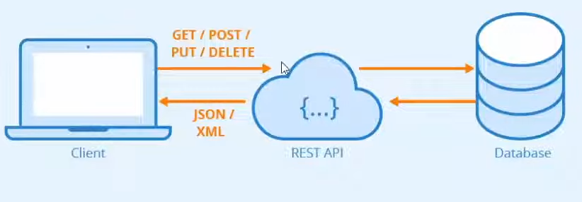

---
### Pré Requisitos para entender/replicar o projeto:

- Lógica de programação
- Orientação a objetos
- Java
- Conhecimentos básicos de métodos HTTP (GET, POST, PUT, DELETE) 
- HTML
- Banco de dados relacional (MySQL)
- Git e GitHub

---

### O que são APIs RESTful?

<b>
Figura 1: Api's restful </b>
  

APIs RESTful são APIs que seguem o padrão REST, que é um conjunto de princípios que definem como deve ser o comportamento de uma API. O termo REST foi definido por Roy Fielding em sua tese de doutorado e é a abreviação de Representational State Transfer, que em português significa Transferência de Estado Representacional.

---

### O que é o SpringBoot?

O Spring Boot é um projeto da Spring que veio para facilitar o processo de configuração e publicação de nossas aplicações. Com ele, podemos criar aplicações standalone que já incorporam um servidor de aplicação, como o Tomcat, por exemplo, e que já possuem todas as dependências necessárias para o desenvolvimento de uma aplicação web.

---

### O que é o padrão MVC?